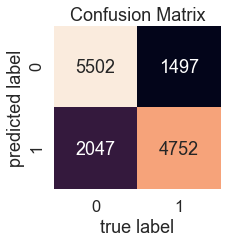

# Heart_Disease_Prediction

## 1. Problem Definition
Given clinical parameters about a patient, can we predict whether or not they have heart disease?

## 2. Data
The original data came from the Cardiovascular Disease dataset-Kaggle.

We use the independent variables to predict our dependent variable.

## 3. Evaluation
If we can reach 80% accuracy at predicting whether or not a patient has heart disease during the proof of concept, we'll pursure this project.

## 4. Features
The following are the features we'll use to predict our target variable (heart disease or no heart disease).

* age - int (days)
* height - int (cm)
* weight - float (kg)
* gender - categorical code - (1: female, 2: male)
* ap_hi - int (mg/dl) - Systolic blood pressure
* ap_lo - int (mg/dl) - Diastolic blood pressure
* cholesterol - (1: normal, 2: above normal, 3: well above normal)
* gluc - Glucose - (1: normal, 2: above normal, 3: well above normal)
* smoke - binary - (0: no, 1: yes)
* alco - binary - Alcohol intake - (0: no, 1: yes)
* active - binary - Physical activity - (0: no, 1: yes)
* cardio - binary - Presence or absence of cardiovascular disease - (0: no, 1: yes)

## 5. Result

### Evaluate Models

### Accuracy Based on Model Predicting Time

## 6. Tuned model (LightGBM)

## 7. Evaluating a classification model

